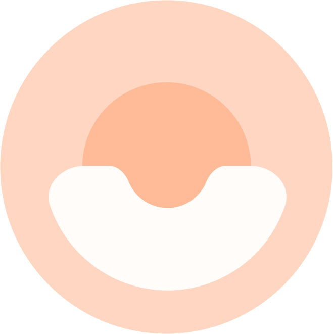

# The Airy's Blog

Welcome to the Airy blog! Here you'll find updates on the latest features, improvements, and news from the Airy team.

<section class="latest-posts">

## Latest Posts

<ul class="articles">
  <li v-for="post in data" :key="post.id">
    <article>
      <h1 class="post-title"><a :href="post.path">{{ post.title }}</a></h1>
      
{{ post.date }}

      

          <Author v-for="author in post.authors" :avatar="author.avatar" :name="author.name"/>
      

      
{{ post.excerpt }}

      <a :href="post.path">Read more</a>
    </article>
  </li>
</ul>

</section>
